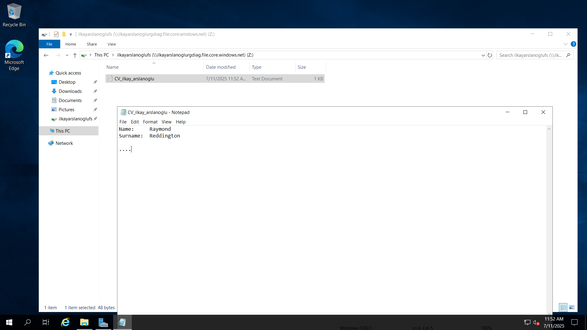

## Assignment: Set Up an Azure Virtual Machine with a Free Account

## Objective

#### The purpose of this assignment is to enable students to gain the skills to create, configure, and perform basic management of virtual machines on the Azure platform.

## Assignment Steps:

### 1-  Create an Azure Account:
I have created a free trial Azure account with a €200 balance, which provides access to a wide range of Azure services for learning and experimentation.

 
---
### 2- Create a Resource Group:
I logged in to the Azure portal and created a new resource group named `IlkayArslanoglu_RG` in the West Europe region. This resource group will contain all resources related to my assignment.

---

### 3- Create a Virtual Machine:

I navigated to the "Virtual machines" service and created a new VM named `IlkayArslanoglu-VM` in the same region as my resource group.
  
- **Image:** Windows Server 2019 Datacenter  
- **Size:** Standard_B1s (to optimize free trial credits)
  
- **Administrator username and password:** Set securely  
- **Networking:** Default virtual network and subnet, with a public IP assigned
  
- **NSG rules:** RDP (port 3389) enabled for remote access  
All settings were reviewed before creating the VM.

---

### 4-Connect to the Virtual Machine:
After deployment, I connected to the VM using the RDP file downloaded from the Azure portal. I logged in with the administrator credentials I set during creation.

---

### 5-Create and Connect to Azure File Share:
I created a new storage account in the Azure portal and, within it, a new file share named `CV_ilkay_arslanoglu`.
  
- On the VM, I mapped the file share as a network drive using the PowerShell script provided by Azure:

$connectTestResult = Test-NetConnection -ComputerName ilkayarslanoglurgdiag.file.core.windows.net -Port 445
if ($connectTestResult.TcpTestSucceeded) {
    # Save the password so the drive will persist on reboot
    cmd.exe /C "cmdkey /add:`"ilkayarslanoglurgdiag.file.core.windows.net`" /user:`"localhost\ilkayarslanoglurgdiag`" /pass:`"UBwFaN9VDunXShK4Ae/nx8fV0PhJVDHlkhhAOPq2NNuWxrI1qlKwqMGpfZSYb+10VJQJIB7uSRdk+AStkY+OrQ==`""
    # Mount the drive
    New-PSDrive -Name Z -PSProvider FileSystem -Root "\\ilkayarslanoglurgdiag.file.core.windows.net\ilkayarslanoglufs" -Persist
} else {
    Write-Error -Message "Unable to reach the Azure storage account via port 445. Check to make sure your organization or ISP is not blocking port 445, or use Azure P2S VPN, Azure S2S VPN, or Express Route to tunnel SMB traffic over a different port."
}

- On my local PC, I also mapped the file share as a network drive (Z:) using the same script.  
This allowed me to easily transfer files between my PC and the VM.

---

### 6-Challenges Faced and Solutions:
- **Azure Free Trial Account Creation:**  
  While trying to create a free trial Azure account, I faced issues where the system would not allow me to proceed without providing a detailed explanation. I tried multiple options such as using a different browser and a different credit card, but these did not resolve the issue. Eventually, I was able to create the account by opening the browser in incognito mode.

- **Azure File Share Connectivity:**  
  Another challenge occurred when connecting to Azure File Share. My ISP did not allow traffic over port 445, which is required for SMB connections. After some troubleshooting, I resolved this by connecting to the internet using my mobile phone’s hotspot, which allowed the necessary port to be accessible.

These experiences helped me develop troubleshooting skills and learn alternative approaches to common cloud and networking issues.

